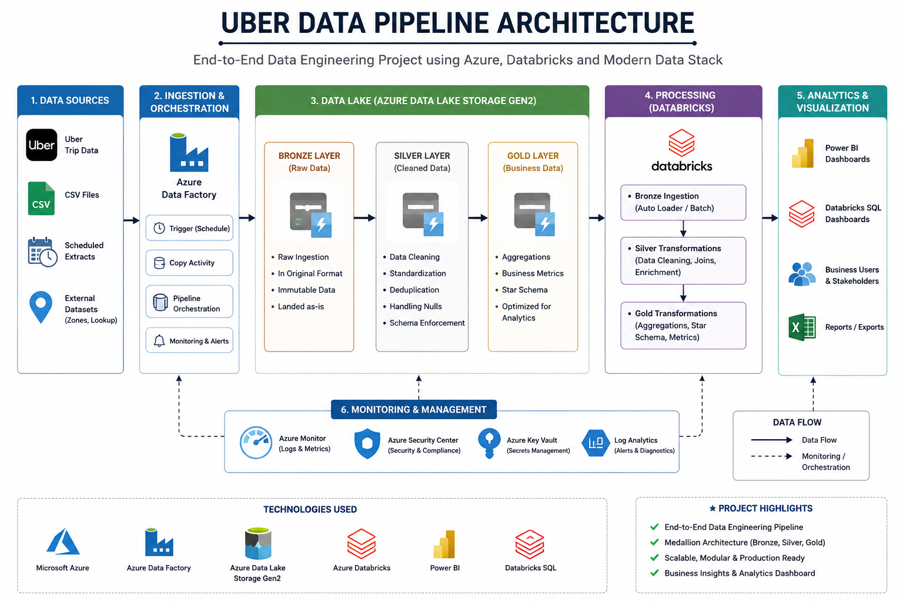
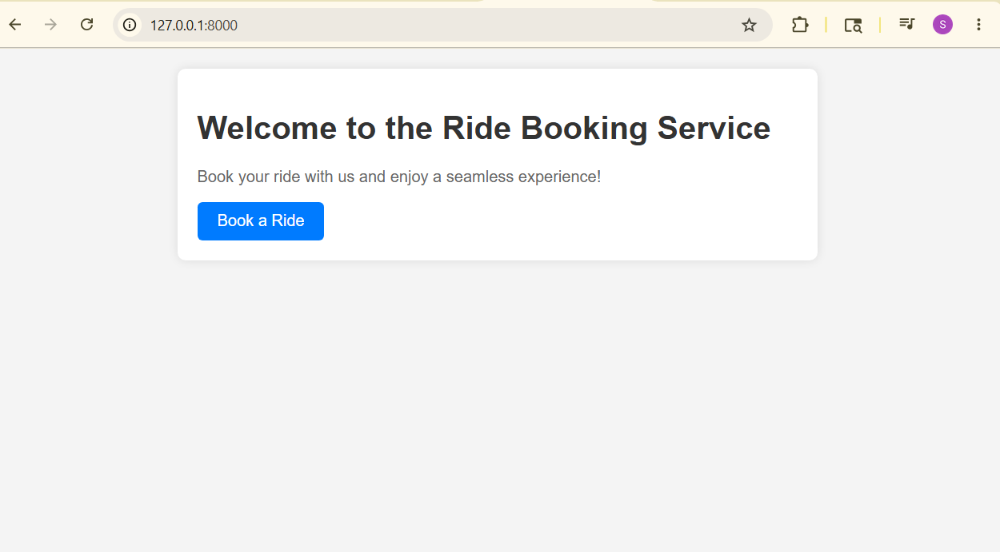
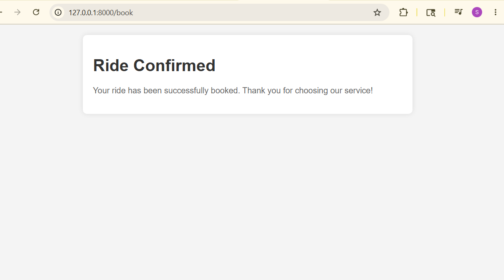
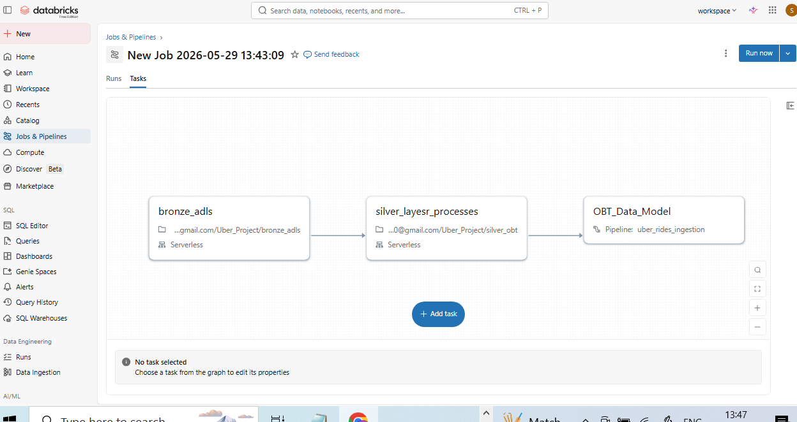
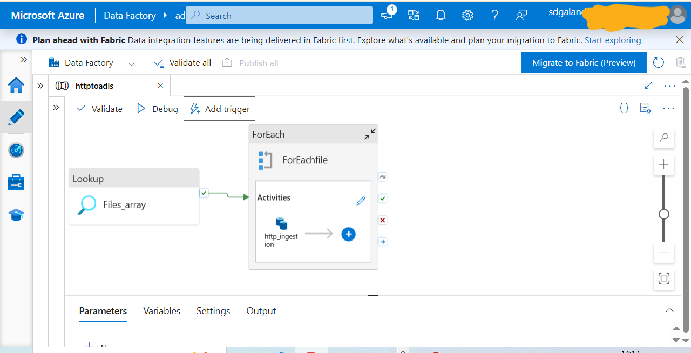

# Uber Data Engineering Pipeline

## Project Overview

This project demonstrates an end-to-end Uber Data Engineering Pipeline built using modern cloud-based data engineering technologies. The solution focuses on ingesting, transforming, and analyzing Uber trip data through a scalable architecture.

The project leverages Azure and Databricks-based services to implement a Medallion Architecture (Bronze, Silver, Gold layers), enabling efficient data processing, transformation, and analytics.

## Project Objectives

* Build a scalable end-to-end data engineering pipeline for Uber trip data.
* Ingest raw data from source systems into cloud storage.
* Process and transform data using Databricks.
* Implement Medallion Architecture for structured data processing.
* Create analytical datasets for reporting and visualization.
* Enable business insights using dashboards and analytics.

## Architecture

### High-Level Architecture


## Architecture Screenshot

> Add your architecture diagram screenshot here.
>
> Recommended file path:
> `images/architecture.png`

Example:

```md

```

## Frontend / Dashboard Screenshot

> Add the frontend/dashboard screenshots here.
>
> Recommended file path:
> `images/frontend-dashboard.png`

Example:

```md

```

## Tech Stack

### Cloud & Data Engineering

* Microsoft Azure
* Azure Data Factory (ADF)
* Azure Blob Storage
* Azure Databricks
* Delta Lake
* Unity Catalog

### Programming & Processing

* Python
* PySpark
* SQL
* Databricks Notebooks

### Version Control

* Git
* GitHub

## Data Pipeline Flow

### 1. Data Ingestion

* Source data is maintained in GitHub.
* Azure Data Factory fetches the raw JSON/CSV files.
* Files are ingested into Azure Blob Storage Bronze Layer.

### 2. Bronze Layer (Raw Data)

* Stores raw Uber trip datasets.
* Preserves source data without transformation.
* Used for data lineage and reprocessing.

### 3. Silver Layer (Cleaned Data)

* Data cleaning and standardization.
* Schema validation.
* Null handling and deduplication.
* Data quality improvements.

### 4. Gold Layer (Business Data)

* Analytical data models.
* Business aggregations.
* KPI-ready datasets.
* Optimized for reporting.

### 5. Analytics & Dashboard

* Processed data is used for business reporting.
* Dashboards provide insights into Uber trips.
* Helps analyze ride trends and operational metrics.

## Project Structure

```bash
uber_data_pipeline/
│── data/
│── notebooks/
│   ├── bronze_layer
│   ├── silver_layer
│   └── gold_layer
│── architecture/
│── images/
│── README.md
```

## Key Features

✅ End-to-End Data Engineering Pipeline
✅ Medallion Architecture (Bronze, Silver, Gold)
✅ Cloud-Based Scalable Processing
✅ Automated Data Ingestion
✅ Delta Lake Storage
✅ Data Transformation with PySpark
✅ Analytics Ready Data Model
✅ GitHub Integration

## Sample Business Use Cases

* Ride demand analysis
* Trip distance analysis
* Revenue trend monitoring
* Peak hour ride identification
* Vendor performance tracking
* Payment type analysis

## How to Run the Project

### Step 1: Clone Repository

```bash
git clone https://github.com/snehaldattugalande/uber_data_pipeline.git
```

### Step 2: Configure Azure Services

* Create Azure Blob Storage.
* Configure Azure Data Factory.
* Create Azure Databricks Workspace.
* Set up Unity Catalog and external locations.

### Step 3: Upload Source Files

Upload Uber trip data files into the configured source location.

### Step 4: Execute Pipeline

1. Run Azure Data Factory pipeline.
2. Execute Bronze notebook.
3. Execute Silver notebook.
4. Execute Gold notebook.

### Step 5: Visualize Data

Connect Power BI or preferred BI tool to Gold Layer data.

## Screenshots

### Frontend / Dashboard

Add screenshots here:

```md

```

### Databricks Workflow

```md

```

### Pipeline Execution

```md

```

## Future Enhancements

* Real-time streaming with Event Hub/Kafka.
* CI/CD integration using Azure DevOps.
* Data quality monitoring.
* Automated orchestration.
* Machine Learning for ride demand forecasting.

## Learning Outcomes

This project demonstrates practical implementation of:

* Data Engineering Concepts
* ETL/ELT Pipelines
* Azure Cloud Services
* Databricks and Delta Lake
* Medallion Architecture
* Data Transformation using PySpark
* Scalable Analytics Architecture

## Author

**Snehal Galande**

* GitHub: [https://github.com/snehaldattugalande](https://github.com/snehaldattugalande)

## License

This project is for learning and portfolio demonstration purposes.
